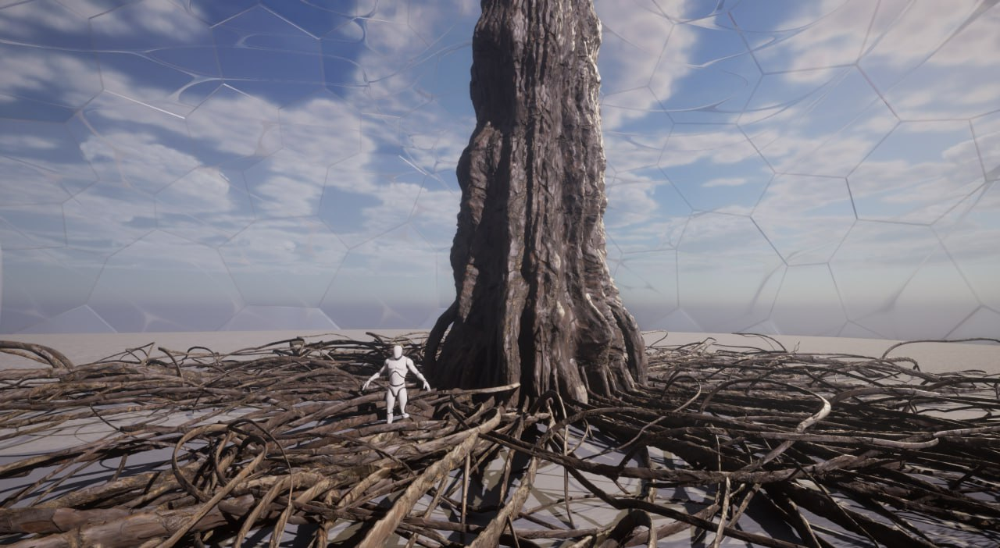
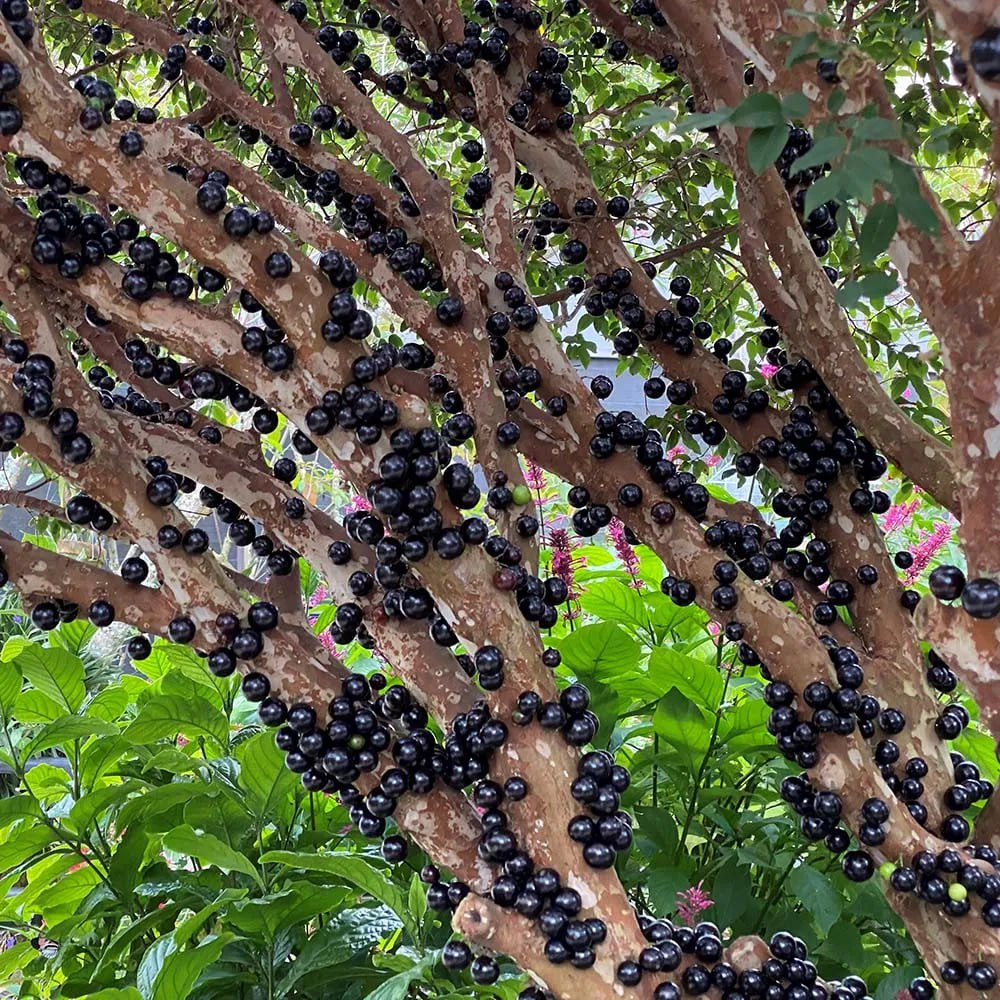
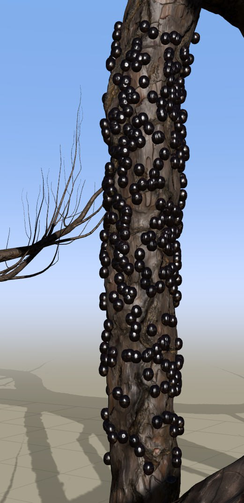
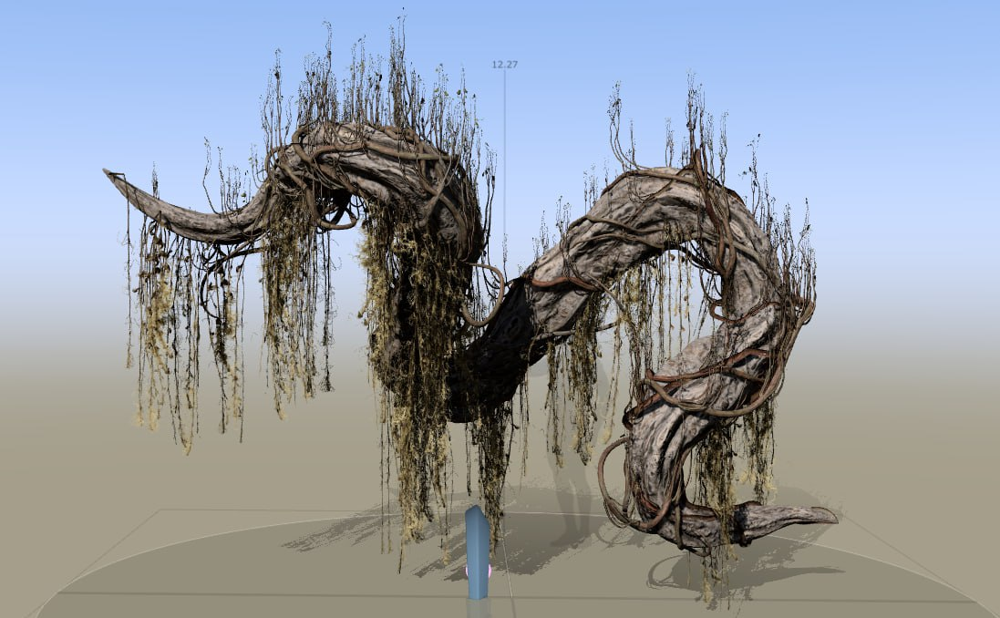
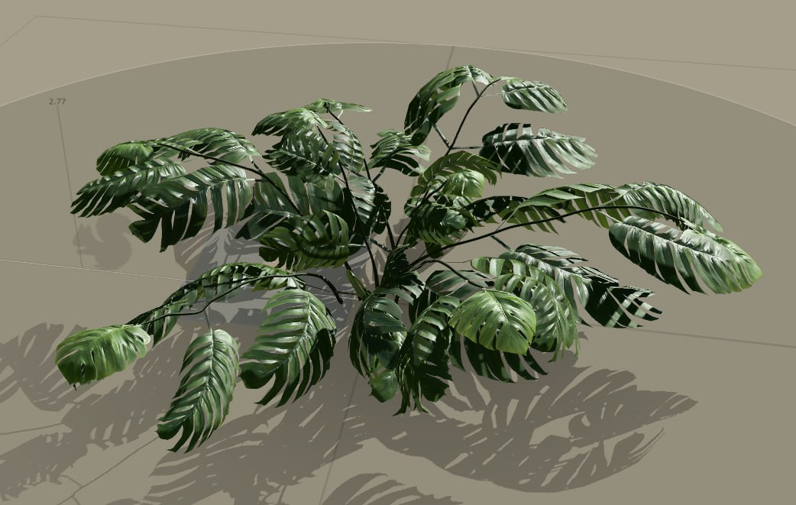

# Biosphere-Contributions
This repository summarizes my contributions to Ula and Sylvia's shared practical Biosphere thesis. During the development of the project, I was largely responsible for the creation of the various vegetation assets in Speedtree, their shaders and some minor look-development in Unreal Engine.
# Building the main computer
The original setup concept for the project involved a single computer to render multiple realtime shots simultaneously using Unreal Engine, for which we build our own computer. As I have been assembling computers before, I was responsible for picking out the parts and assisted Sylvia during assembly. 
Our budget allowed for a build centered around an Nvidia 4070Super, which proved to be very capable throughout the project, although we decided to render the two shots on seperate computers due to practical reasons. 

# Creating the mangrove

For the creation of the mangrove, I received a set of reference images. Since the images were all rather different, I ended up with a sort of synthesis of them all in the end. The image we referenced the most was this:

One key difference between our goal and the reference images was that most of the trees were supposed to be hollowed out on the inside by unnatural, geometric forces. I managed to achieve this kind of effect by adding primitives as collision forces in Speedtree:

For the texturing of the tree, I relied once again on the megascan library and chose a bark from a banyan tree with decreased saturation and increased brightness.

From that point onward, I started to experiment with increasingly abstract for the individual trees, of which some made it into the final project:

Lastly, I created the root stumps for the scene:

Overall, I was very happy happy with the final result and learned a lot about the use of forces in modelling in the process!

 

# Creating the rainforest:

For the rainforest, the general compositional idea was to have a large, banyan like tree as the centre, surrounded by symmetrical-at-large but varied-in-detail elements such as trees, vines and ground vegetation. I started off with the trunk and tried to find a suitable look for the large root network:

Following a suggestion from Ula to add some kind of fruit to the tree, I got inspired to incorporate the look of the [Jabuticaba Tree](https://en.wikipedia.org/wiki/Jabuticaba):

I added multiple smaller trees, growing outside the larger banyan-like trunk to bear the fruits:

Next, I started to develop the setup for the vine overgrowth, for which I had to create a collision object based on the main trunk:

Initially, the foliage feature another kind of leaf and flowers, before I created after consultation with Sylvia the final atlas. 

To provide further detail onto the trunk, I developed a semi-procedural approach to add Lichen (a kind of moss):

After adding additional details such as hanging vines, I moved on to the additional assets, such as the large dead vine-like structures:

Next up was ground vegetation, including this little cheese plant:

I also added some of the leaves from the ground vegetation onto the larger tree as well:

Needless to say, I was very happy with Sylvia's and Ula's final composition :)

# Additional contributions
In addition to the creation of the assets, I also assisted with

    – The creation of the shaders for foliage and barks
    - The lighting setup
    - Performance optimization
    - The fog setup
    - The post process setup
    - The movie renderqueue setup

# Learnings

In addition to the technical learnings, the projects showed me the importance of precise references and communication for group projects. Some reiterations could have been prevented if I would have insisted on more directed guidance instead of trying to figure things out completely on my own, mostly with my own goals and aesthetic interests in mind. 